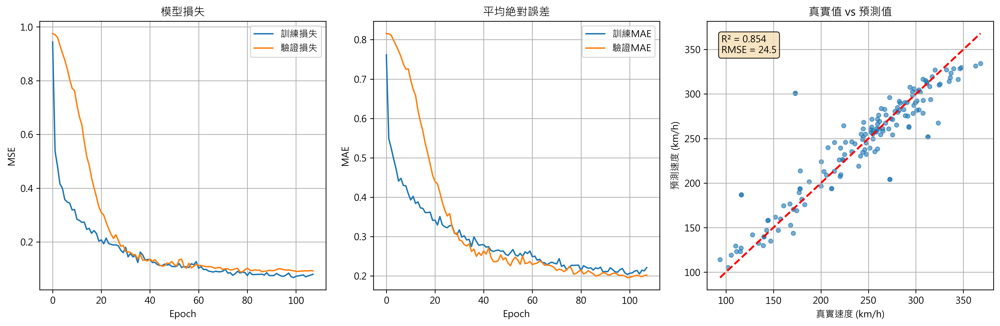
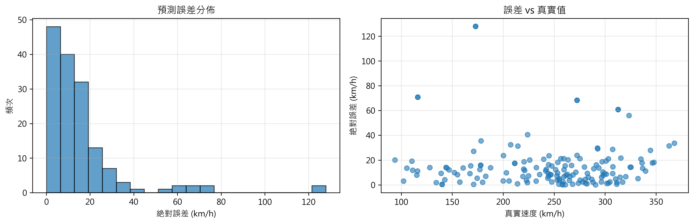

# Badminton Speed Prediction API


This project is a FastAPI-based web service that predicts badminton shuttlecock speed from sensor data using a pre-trained TensorFlow model.

## Project Structure


```
AIOT-Badminton-Speed-API/
├── app/
│   ├── __init__.py
│   ├── core/
│   │   ├── __init__.py
│   │   └── config.py           # Model loading and app configuration
│   ├── models/
│   │   ├── __init__.py
│   │   └── schemas.py          # Pydantic schemas for API requests/responses
│   ├── services/
│   │   ├── __init__.py
│   │   └── prediction_service.py # Data preprocessing and prediction logic
│   └── main.py                 # FastAPI application entry point
├── ml_model/
│   ├── __init__.py
│   ├── badminton_speed_predictor.h5  # Trained TensorFlow model
│   ├── feature_scaler.pkl            # Scikit-learn feature scaler
│   └── target_scaler.pkl             # Scikit-learn target scaler
├── data/                            # Raw and processed data files
├── requirements.txt                 # Python dependencies
├── api_test.py                      # API testing script
├── train.py                         # Model training script
├── label_pseudo_speed.py            # Pseudo-labeling script
├── label_real_speed.py              # Real-labeling script
├── correlation.py                   # Data correlation analysis
├── describe.py                      # Data description script
└── README.md
```

## Setup and Installation


1. **Clone the repository:**
    ```bash
    git clone <repository_url>
    cd AIOT-Badminton-Speed-API
    ```
2. **Create a virtual environment:**
    ```bash
    python3 -m venv venv
    source venv/bin/activate
    ```
3. **Install dependencies:**
    ```bash
    pip install -r requirements.txt
    ```

## Running the Application


Start the FastAPI server from the project root:

```bash
python app/main.py
```

The API will be available at [http://localhost:8000](http://localhost:8000).

## API Endpoints


- **GET `/`**  
  Returns a welcome message and lists available endpoints.

- **GET `/health`**  
  Health check for the service and model loading status.

- **POST `/predict_speed`**  
  Predicts shuttlecock speed from a single set of sensor data.
  - **Request Body:**  
    ```json
    {
      "sensor_data": [ ...30 SensorFrame objects... ]
    }
    ```
  - **Response:**  
    ```json
    {
      "predicted_speed": <float>,
      "confidence_info": <object>
    }
    ```

- **POST `/predict_speed_batch`**  
  Batch prediction for multiple sensor data inputs.
  - **Request Body:**  
    ```json
    {
      "sensor_data_batch": [ ...PredictionRequest objects... ]
    }
    ```
  - **Response:**  
    ```json
    {
      "predictions": [ ...PredictionResponse objects... ]
    }
    ```

## Testing the API


You can test the prediction endpoint using the provided script:

```bash
python api_test.py
```

Make sure the FastAPI server is running before executing the test script.

## Model and Data


- The pre-trained model (`badminton_speed_predictor.h5`) and scalers (`feature_scaler.pkl`, `target_scaler.pkl`) are in the `ml_model/` directory.
- Raw and processed data files are in the `data/` directory.

## Development


- `train.py`: Script for training the shuttlecock speed prediction model. Main steps include:
    - **Data Loading:** Reads JSON data containing samples with 30 time steps of 6-axis IMU sensor data (ax, ay, az, gx, gy, gz) and the corresponding speed label.
    - **Data Validation:** Ensures each sample contains exactly 30 frames; skips samples with missing data.
    - **Feature Engineering:** Optionally extracts statistical features from the time series (mean, std, max, min, range, IQR for each axis).
    - **Preprocessing:**
        - Standardizes the sensor features using `StandardScaler` (fit on all features, then reshaped back to [samples, 30, 6]).
        - Standardizes the target speed values.
    - **Dataset Split:** Splits the data into training, validation, and test sets (70%/15%/15%).
    - **Model Architecture:**
        - 1D Convolutional layer for local feature extraction.
        - Batch normalization, max pooling, and dropout for regularization.
        - Stacked LSTM layers for temporal sequence modeling.
        - Dense layers for regression output.
    - **Training:**
        - Uses Adam optimizer and MSE loss.
        - Early stopping and learning rate reduction callbacks for robust training.
        - Trains for up to 200 epochs with batch size 64.
    - **Evaluation:**
        - Reports MAE, RMSE, and R² on the test set.
        - Visualizes training history, prediction scatter, and error distribution (plots saved to `ml_model/`).
    - **Model Saving:**
        - Saves the trained model (`badminton_speed_predictor.h5`) and scalers (`feature_scaler.pkl`, `target_scaler.pkl`) to `ml_model/`.
    - **Prediction Example:**
        - Prints several random test predictions with true value, predicted value, and error.
    - **Model Complexity:**
        - Prints total and trainable parameter counts, and training epoch count.
- `label_pseudo_speed.py`: Generate pseudo labels for data.
- `label_real_speed.py`: Assign real labels to data.
- `correlation.py`: Analyze data correlations.
- `describe.py`: Summarize and describe data.

## Model Training Results

The following figures summarize the model's training and evaluation performance:

### Training Curves and Prediction Performance



- **Left:** Model loss (MSE) over epochs for training and validation sets. Both curves decrease and stabilize, indicating effective learning and no significant overfitting.
- **Middle:** Mean Absolute Error (MAE) over epochs for training and validation sets, showing similar convergence.
- **Right:** Scatter plot of true vs. predicted shuttlecock speeds on the test set. The red dashed line represents perfect prediction. The model achieves a coefficient of determination $R^2$ of approximately 0.85 and a root mean squared error (RMSE) of about 24.5 km/h, indicating strong predictive performance.

### Error Analysis



- **Left:** Histogram of absolute prediction errors. Most errors are within 20 km/h, with a few larger outliers.
- **Right:** Scatter plot of absolute error vs. true speed. Errors are generally low across the range of true speeds, with some higher errors at certain speeds.

These results demonstrate that the model can accurately predict shuttlecock speed from IMU sensor data, with most predictions closely matching the true values.